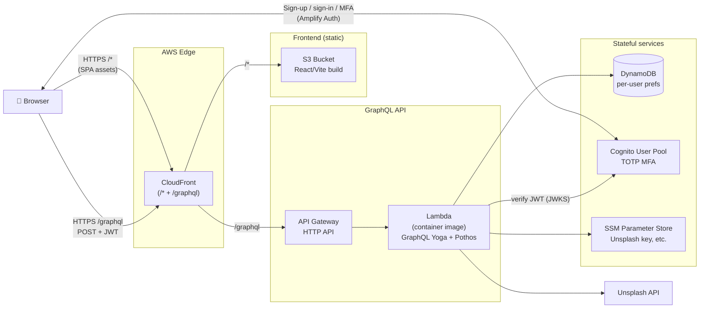

# Building Better Algorithms

An educational full-stack capstone project that teaches how a simple
**preference-learning algorithm** works by letting users train one in real time.
Users rate travel photos from around the world, and a feedback loop adjusts their
country preferences — visualized live on a dashboard.

- **Domain:** `buildbetteralgorithms.com` — registered for the rebuild. (v1 ran on
  the now-lapsed `buildingbetteralgorithms.com`.)
- **Status:** Active refactor — DEV environment deployed; backend (Phase 1) is next.

---

## Overview

The app walks a user through a complete machine-feedback loop:

1. **Sign up / log in** — animated landing page (HomePage) with register + login forms.
2. **Set preferences** — pick like/dislike for 12 cities. This seeds a 12-element
   preference array (liked = `50`, disliked = `5`, scale `0–100`).
3. **Travel** — the app fetches real photos from the Google Places API, weighted by
   the preference array. The user likes (single click) or dislikes (double click)
   each photo and submits.
4. **Learn** — submitted feedback is run through the algorithm, which nudges each
   country's score up or down by a fixed learning increment (`±5`, clamped `0–100`).
5. **Dashboard** — the updated preference array is rendered as a GeoChart, pie chart,
   and column chart using Google Charts.

There is a hard usage limit of 4 image batches (32 photos) per session to stay
within Google Places API quota.

### The algorithm

`backend/backend/algorithm.py` — `update_preferences(data)`:

- Input: first 12 elements are the current preferences, followed by feedback entries
  formatted `choice:location` (`choice` = `1` like / `0` dislike).
- A liked country gains `+5`; a disliked country loses `-5`; values are clamped to
  `0–100` (and bounced off the rails: `100→95`, `0→5`) so no country is ever fully
  excluded from the weighted random draw.

`backend/backend/places.py` — `run_process(preferences)`:

- Normalizes the preference array into weights, then for 8 iterations does a weighted
  random pick of a city and fetches a nearby `tourist_attraction` photo via Google
  Places. Returns strings formatted `locationIndex:photoUrl`.

> Note: `algorithm-testing/` contains earlier standalone prototypes of these two
> files (a `0.0–1.0` scale variant). They are experiments, not used in production.

---

## Tech Stack

The refactored stack (active development):

| Layer        | Technology |
|--------------|------------|
| Frontend     | Vite + React 19, TypeScript, urql + GraphQL Code Generator, AWS Amplify Auth |
| Backend      | Node.js + TypeScript, AWS Lambda (container image), GraphQL Yoga + Pothos |
| Auth         | AWS Cognito (TOTP MFA); Amplify Auth client-side |
| Database     | AWS DynamoDB — per-user preference map (always-free tier) |
| External API | Unsplash API (weighted random travel photo selection) |
| Hosting      | S3 + CloudFront (SPA + `/graphql` proxy); API Gateway HTTP API in front of Lambda |
| IaC          | Terraform — three environments (`dev` / `qa` / `prod`) in one AWS account |
| CI/CD        | GitHub Actions — lint, SAST, dep scan, IaC scan, SBOM, tests, deploy, DAST |

The archived v1 stack (Django + Create React App + Elastic Beanstalk) lives under `legacy/` and is the reference for app behavior.

---

## Deployed Architecture

One CloudFront distribution fronts everything — the SPA from S3 at `/*`, and the
GraphQL API via API Gateway at `/graphql`. Same origin, no CORS, single TLS cert.



**Request flow for a typical mutation** (e.g. `submitFeedback`):

1. Amplify Auth in the browser supplies the Cognito ID token from secure cookies.
2. urql sends `POST /graphql` with `Authorization: Bearer <jwt>`.
3. CloudFront forwards `/graphql` to the API Gateway HTTP API (default cache disabled,
   `AllViewerExceptHostHeader` policy forwards the JWT).
4. API Gateway invokes the Lambda container with payload-format v2.
5. The Lambda verifies the JWT against the Cognito pool's JWKS, runs the resolver
   (updates `preferences` in DynamoDB, fetches Unsplash images for `travelImages`,
   etc.), and returns the GraphQL response back through API Gateway → CloudFront →
   the browser.

> **Why API Gateway instead of a Lambda Function URL?** The original plan called for
> `CloudFront → Lambda Function URL`. New AWS accounts have a guardrail that blocks
> anonymous Function URL access regardless of resource policy, and the CloudFront
> OAC + SigV4 path proved brittle in practice. API Gateway HTTP APIs are free for
> the first 1M requests/month and route to the same Lambda with the same payload
> format — no signing required.

---

## Repository Structure

The refactor is underway — the v1 codebase is archived under `legacy/` (still the
reference for app behavior) while the new TypeScript stack is built in `frontend/`,
`backend/`, and `infra/`. See the [Roadmap](#roadmap).

```
CAPSTONE/
├── frontend/        # NEW — Vite + React + TypeScript SPA (built in Phase 2)
├── backend/         # NEW — Node.js + TypeScript GraphQL Lambda (built in Phase 1)
├── infra/           # NEW — Terraform infrastructure (built in Phase 3)
├── legacy/          # Archived v1 — reference only, removed after the refactor
│   ├── backend/             # v1 Django REST API
│   ├── frontend/            # v1 Create React App SPA
│   └── algorithm-testing/   # v1 algorithm prototypes
├── README.md
└── LICENSE.md
```

---

## Local Development

> The instructions below are for the **archived v1 app**, now under `legacy/`.
> Setup for the new TypeScript stack will be documented as it is built (Phases 1–3).

### Prerequisites

- Node.js 18+ and npm
- Python 3.10+
- A MySQL database (local or remote)
- A Google Places API key

### Backend

```bash
cd legacy/backend
python -m venv venv
source venv/bin/activate            # Windows: venv\Scripts\activate
pip install -r requirements.txt
python manage.py migrate
python manage.py runserver
```

Create a `.env` file in `backend/` (loaded via `python-dotenv`):

```ini
SECRET_KEY=your-django-secret-key
HOST_1=localhost
HOST_2=127.0.0.1
HOST_3=
HOST_4=
NAME=your_db_name           # MySQL database name
USER=your_db_user           # MySQL user  (see Known Limitations)
PASSWORD=your_db_password
HOST=your_db_host
PORT=3306
KEY=your_google_places_api_key
```

### Frontend

```bash
cd legacy/frontend
npm install
npm start                            # http://localhost:3000
npm run build                        # production build into frontend/build/
```

The frontend reads `REACT_APP_API_BASE_URL` (see `frontend/.env.production`).
The production build is copied into `backend/build/` so Django can serve it.

---

## API Reference

All endpoints are served by Django. Auth is session-based (cookie + CSRF).

| Method | Endpoint                      | Description |
|--------|-------------------------------|-------------|
| POST   | `/register/`                  | Create a user account |
| POST   | `/login/`                     | Authenticate, start a session |
| POST   | `/logout/`                    | End the session |
| GET    | `/user-info/`                 | Get name, username, preferences (auth required) |
| PATCH  | `/user-info/`                 | Update name / email / password / preferences |
| DELETE | `/delete-account/`            | Delete the current account |
| POST   | `/api/get-images/`            | Fetch preference-weighted Google Places photos |
| POST   | `/api/process-interactions/`  | Run feedback through the algorithm, return new preferences |
| GET    | `/`, `/*`                     | Serve the React SPA (`index.html`) |

---

## Deployment (v1 — no longer running)

v1 was deployed to **AWS Elastic Beanstalk** on the Python platform:

- `backend/.ebextensions/django.config` — sets the WSGI path and static file routing.
- `backend/.ebextensions/db-migrate.config` — runs `manage.py migrate` on deploy
  (leader instance only).
- `collectstatic` runs on deploy; the React build is served as Django static files.
- The database is a MySQL instance on AWS RDS.

---

## Known Limitations

These are documented honestly to inform the refactor — see [Roadmap](#roadmap).

- **Broken auth flow.** The frontend sends `Authorization: Bearer <localStorage token>`,
  but Django uses *session* auth — no token is ever issued, so the header is inert.
  `AuthContext` keeps `isAuthenticated` only in memory, so it resets on refresh.
- **`USER` env var collision.** `settings.py` reads the DB user from `os.environ.get('USER')`.
  On Unix, `USER` is the OS-level current-user variable, which can silently override
  the intended value.
- **Inconsistent API base URL.** `config.js` hardcodes one URL; some pages use
  `process.env.REACT_APP_API_BASE_URL`; others call relative paths (`/user-info/`).
- **Bloated `requirements.txt`.** Includes unused MongoDB packages (`djongo`,
  `mongoengine`, `pymongo`), `virtualenvwrapper-win`, and other leftovers.
- **Repo hygiene.** A 16 MB `debug.log` and `db.sqlite3` are committed; `build/` and
  `staticfiles/` artifacts are tracked.
- **CORS** relies on the SPA being served same-origin by Django; no
  `CORS_ALLOWED_ORIGINS` is configured for a split deployment.
- **No automated tests** beyond the Create React App default.

---

## Roadmap

The project is being refactored with these goals:

- Rebuild the stack in **TypeScript** end-to-end (React frontend, Node backend).
- Re-deploy on the **AWS always-free tier** with **AWS Lambda** as the compute layer.
- Use **Terraform** for infrastructure as code.
- Adopt **GraphQL** (self-hosted in the Lambda) as the API.
- Move to a **free-tier database** (DynamoDB).
- Redesign preferences as a **keyed per-country map** (replacing the brittle
  positional array) — seeded neutral and learned from Travel feedback.
- Replace the broken auth with **AWS Cognito** — authenticator-app (TOTP) MFA.
- Add a **CI/CD pipeline** (GitHub Actions) with a full security-scanning suite
  (SAST, DAST, dependency/container/IaC scanning, SBOM) across DEV / QA / production.
- Clean up dependencies and split frontend/backend hosting.

### Phase status

| Phase | Scope | Status |
|---|---|---|
| 0 | Repo hygiene — archived v1, created new skeleton | ✅ Done |
| 1 | Backend — TypeScript GraphQL Lambda | 🔜 Next |
| 2 | Frontend — Vite + React + TypeScript SPA, Amplify Auth | ✅ Done |
| 3 | Terraform — all AWS infrastructure provisioned | ✅ Done |
| 4 | CI/CD — GitHub Actions pipelines + security scanning | ✅ Done |
| 5 | Deploy — DEV → QA → production release | 🚀 In progress — DEV live |

---

## License

See [LICENSE.md](LICENSE.md).

## Author

Collin Streitman
