# Infrastructure

Terraform configuration for the AWS deployment — one stack per environment
(`dev`, `qa`, `prod`) sharing a single AWS account.

## Prerequisites

| Tool | Version | Install |
|---|---|---|
| Terraform | ≥ 1.7 | `brew install tfenv && tfenv install 1.9.8` |
| AWS CLI | v2 | already configured (`collin-admin`) |
| Docker | any | required for Phase 1 Lambda image builds |

## Architecture

```mermaid
architecture-beta
    group aws(logos:aws)[AWS]

    service browser(internet)[Browser]
    service unsplash(internet)[Unsplash]

    service cf(logos:aws-cloudfront)[CloudFront] in aws
    service s3(logos:aws-s3)[S3] in aws
    service apigw(logos:aws-api-gateway)[API Gateway] in aws
    service lambda(logos:aws-lambda)[Lambda] in aws
    service dynamo(logos:aws-dynamodb)[DynamoDB] in aws
    service cognito(logos:aws-cognito)[Cognito] in aws
    service ssm(logos:aws-systems-manager)[SSM] in aws

    browser:R --> L:cf
    browser:T --> B:cognito
    cf:R --> L:s3
    cf:B --> T:apigw
    apigw:R --> L:lambda
    lambda:T --> B:cognito
    lambda:R --> L:dynamo
    lambda:B --> T:ssm
    lambda:R --> L:unsplash
```



All environments use the same single AWS account (`958941188378`, `us-east-1`).
Production additionally creates an ACM certificate and Route 53 A records for
`buildbetteralgorithms.com`.

## File layout

| File | Purpose |
|---|---|
| `bootstrap/main.tf` | One-time account setup (state bucket, OIDC provider) |
| `main.tf` | Terraform settings, S3 backend, provider, account data sources |
| `variables.tf` | Input variables (`environment`, `unsplash_access_key`, `alert_email`) |
| `locals.tf` | Naming prefix, environment flags, shared tags |
| `data.tf` | DynamoDB `bba-<env>-prefs` table |
| `auth.tf` | Cognito user pool (TOTP MFA) + app client |
| `frontend.tf` | S3 bucket, CloudFront distribution, OAC, ACM cert + R53 (prod only) |
| `backend.tf` | ECR, Lambda, IAM execution role, CloudWatch log group, API Gateway HTTP API |
| `secrets.tf` | SSM Parameter Store — Unsplash key, Cognito IDs |
| `security.tf` | CloudFront response-headers policy, CloudTrail, billing alarm (prod) |
| `cicd.tf` | GitHub Actions OIDC deploy role (one per environment) |
| `outputs.tf` | CloudFront URL, bucket name, ECR URL, Cognito IDs, deploy role ARN |
| `envs/*.tfvars.example` | Template var files — copy, fill in, run `apply` |

## Step 1 — Bootstrap (once, ever)

Creates the Terraform state bucket, DynamoDB lock table, and GitHub OIDC
provider. These are account-level resources not tied to any environment.

```bash
cd infra/bootstrap
terraform init
terraform apply
```

State is stored locally (`infra/bootstrap/terraform.tfstate`), which is
gitignored. Keep it safe — losing it requires `terraform import` of the three
resources.

## Step 2 — Deploy an environment

### Local / first-time

```bash
cd infra

# 1. Copy the example vars for your target environment
cp envs/dev.tfvars.example envs/dev.tfvars
# Edit dev.tfvars — fill in unsplash_access_key

# 2. Initialise with the environment-specific state key
terraform init -backend-config="key=bba/dev/terraform.tfstate"

# 3. Bootstrap the ECR repository (and lifecycle policy) before pushing an image
#    The Lambda resource cannot be created until an image exists in ECR.
terraform apply -target=aws_ecr_repository.lambda \
                -target=aws_ecr_lifecycle_policy.lambda \
                -var-file="envs/dev.tfvars"

# 4. Push a placeholder image so Terraform can create the Lambda.
#    ECR is IMMUTABLE — never push :latest.  CI will overwrite :placeholder
#    with the real image on the first deploy.
ECR_URL=$(terraform output -raw ecr_repository_url)
aws ecr get-login-password --region us-east-1 | \
  docker login --username AWS --password-stdin "$ECR_URL"
docker pull --platform linux/amd64 public.ecr.aws/lambda/nodejs:20
docker tag public.ecr.aws/lambda/nodejs:20 "$ECR_URL:placeholder"
docker push "$ECR_URL:placeholder"

# 5. Apply everything
terraform apply -var-file="envs/dev.tfvars"
```

### CI/CD (GitHub Actions)

The pipeline passes variables as environment variables — no `.tfvars` file on
the runner. It also handles the ECR bootstrap automatically:

```bash
# Phase 1 — ensure ECR exists before building the image
terraform apply -auto-approve \
  -target=aws_ecr_repository.lambda \
  -target=aws_ecr_lifecycle_policy.lambda

# Phase 2 — push a placeholder image if ECR is empty (first deploy only)
IMAGE_COUNT=$(aws ecr describe-images \
  --repository-name bba-${ENVIRONMENT}-graphql \
  --query 'length(imageDetails)' --output text)
if [ "$IMAGE_COUNT" = "0" ]; then
  docker pull --platform linux/amd64 public.ecr.aws/lambda/nodejs:20
  docker push "$ECR_URL:placeholder"
fi

# Phase 3 — full apply
terraform apply -auto-approve \
  -var="environment=${ENVIRONMENT}" \
  -var="unsplash_access_key=${UNSPLASH_ACCESS_KEY}"
```

`UNSPLASH_ACCESS_KEY` comes from a GitHub Environment secret.
`ENVIRONMENT` is set per workflow trigger (`dev` / `qa` / `prod`).

## Environments

| Workspace trigger | Environment | Domain |
|---|---|---|
| push to `develop` | `dev` | `*.cloudfront.net` |
| push to `main` | `qa` | `*.cloudfront.net` |
| `v*` tag on `main` | `prod` | `buildbetteralgorithms.com` |

## Cost

Everything runs within the AWS always-free tier:

| Service | Free allowance |
|---|---|
| Lambda | 1 M req/mo + 400 GB-s compute |
| API Gateway (HTTP API) | 1 M req/mo (first 12 mo), then $1/M |
| DynamoDB | 25 GB storage, 25 WCU/RCU |
| CloudFront | 1 TB transfer/mo, 10 M requests |
| S3 | 5 GB (first 12 mo), then pennies |
| Cognito | 50 k MAU |
| ECR | 500 MB (first 12 mo) |
| SSM, CloudTrail, ACM | Free |

The only intentional cost is the Route 53 hosted zone (~$0.50/mo), which was
already created when the domain was registered. A billing alarm is provisioned
in the `prod` environment that fires if monthly spend exceeds $5.

## Outputs

After `terraform apply`, the outputs supply the values needed by the frontend
and CI:

```
cloudfront_domain          → base for VITE_GRAPHQL_URL
cloudfront_distribution_id → CloudFront invalidation in CI
frontend_bucket            → S3 sync target in CI
ecr_repository_url         → docker push target
lambda_function_name       → update-function-code target
apigateway_url             → raw API Gateway endpoint (debugging only)
cognito_user_pool_id       → VITE_COGNITO_USER_POOL_ID
cognito_client_id          → VITE_COGNITO_CLIENT_ID
deploy_role_arn            → role assumed by GitHub Actions
graphql_url                → full VITE_GRAPHQL_URL value
```
